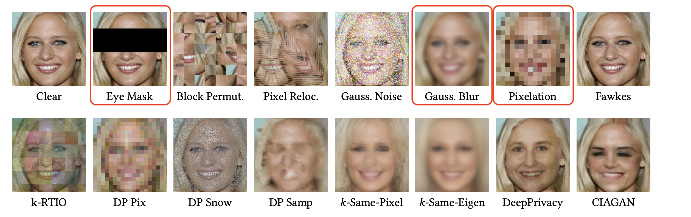
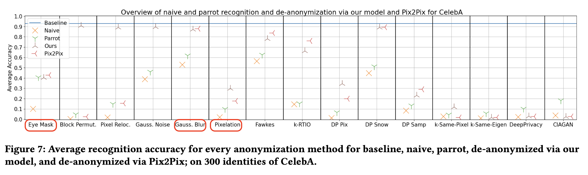
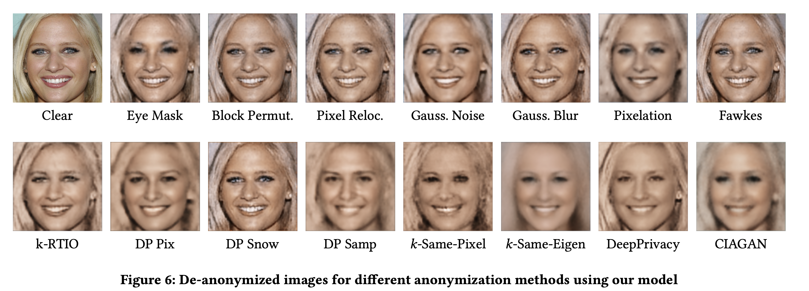

# Hintergrundwissen über Anonymisierungsmethoden & ihre Sicherheit 
Hier ist ein bisschen theoretischer Hintergrund zu Anonymisierungen & ihrer Sicherheit in den Zeiten von KI gesammelt 

## Überblick über verschiedene Anonymisierungsmethoden: 
Die Anonymisierungsmethoden, deren Implementierung ursprünglich geplant war sind rot umkreist 

## Überblick über ihre Sicherheit: 
Die Daten basieren auf einer Studie, in der Wissenschaftler eine KI trainiert haben, die **anonymisierte Bilder erst versucht zu "rekonstruieren"**, um dann eine **Gesichtserkennung** durchzuführen.  
Angegeben sind jeweils die Anteile der (zuvor durch die jeweilige Anonymisierungsmethode anonymisierter) Bilder, die durch die darauf trainierte KI nach (versuchter) Deanonymisierung wieder erkannt werden konnten. 
Die lilanen Kreuze sind das in der Studie trainierte/ entwickelte System.  **Parrot** ist das selbe Modell, nur etwas anders trainiert. **"Naive"** steht für ein Modell, dass _nicht_ weiß, dass die Bilder anonymisiert wurden, und trotzdem eine Identifikation versucht und **Pix2Pix** scheint einfach ein schon vorhandenes Anonymisierungsmodell zu sein.

## Auswertung: 
- **Gaussian Blur**: sehr unsicher, kann mit einer 90-100 % igen Genauigkeit umgekehrt werden  
- **Schwarzer Balken**: semi sicher, kann mit Genauigkeit von ca. 20% umgekehrt werden  
- **Pixelation**: von den drei am Sichersten, kann mit Genauigkeit von ca. 10% umgekehrt werden (in Studie: 16x16 Pixel)
=> alle drei Methoden nicht so super 

- sicherste Methode: **k same eigen** 
=> weitere Recherche dazu folgt

## k-Same-Eigen
Leider nicht leicht zu implementieren, da es auf einer KI, die über eine große Datenbasis verfügt, basiert. Trotzdem kurze Erläuterung der Funktionsweise (damit man versteht, was das Problem bei einer Implementierung ist): 

#### Prinzip der k-Anonymität
- Modifizierung von Daten so, dass jeder einzelne Datensatz gleichwahrscheinlich zu einem von k Individuen gehört. (Je höher k, desto särker die Anonymisierung)b

#### Umsatz für Bilder/ Anonymisierung
- Gruppierung von Indiciduen, die sich in vielen Merkmalen ähnlich sind => Diese Merkmale bleiben auch nach der Anonymisierung noch erhalten
- eine KI auf großen (Bild-) Datensatz trainieren, Repräsentationen dieser Bilder in einer Datenbank sichern
- Bei der Anonymisierung: die k-1 ähnlichsten Bilder in der Datenbank finden, dann daraus den Durchschnitt bilden (wie genau das getan wird ist ein bisschen komplexer und hier nicht der Punkt. Hier ist aber besonders: es wird nicht der Mittelwert der Pixel gebildet, sondern der "Merkmalsausprägungen")

## So sahen übrigens die deanonymisierten Bilder aus 
Nur falls es jemanden interssiert, ist ganz spannend 

Quelle: 
Todt, J, Hanisch, S., Strufe, T. (2022) 'Fantômas: Understanding Face Anonymization Reversibility'. _Cornell University_. Verfügbar unter: https://arxiv.org/pdf/2210.10651 (Zuletzt zugegriffen: 06.03.2026). 

